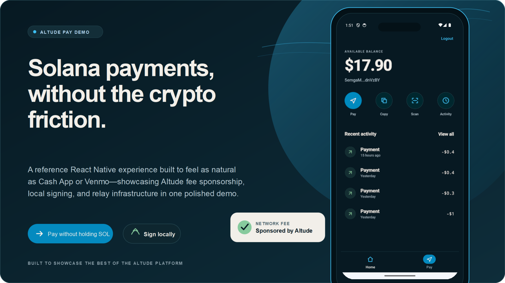
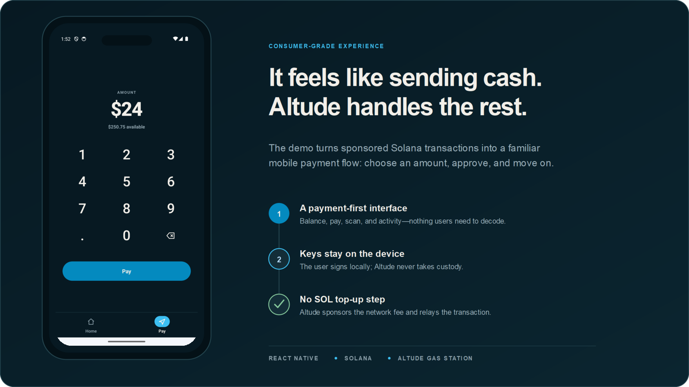

# Altude Pay

**Send USDC on Solana without ever holding SOL.**

Altude Pay is a reference React Native app for [Altude](https://altude.so) Gas Station.
It demonstrates a payment that behaves like an everyday consumer transfer: you enter an
amount, approve it on your device, and it arrives. There is no gas balance to top up,
and the private key never leaves the phone.



## Paying with crypto is still too hard

Most Solana payment flows ask the user to solve a problem they never asked about. Before
they can send a single dollar they need a second token — SOL — purely to pay the network
fee. That means another purchase, another wait, and a balance they have to remember to
keep topped up. If it runs dry, the payment simply fails.

Altude removes that step. Your application builds the transaction and the user signs it
locally; Altude validates it, attaches a sponsored fee payer, and relays it to the
network. The user never acquires SOL, and never surrenders their key to do it.



## What this demo does

- Generates and stores a local demo wallet on the device
- Reads SOL and USDC balances from Solana Devnet
- Builds, locally signs, sponsors, relays and confirms a USDC transfer
- Keeps transaction history and recent recipients on-device
- Generates and scans Solana Pay QR codes

## How it works


A payment moves through four participants:

1. **The app** collects the amount ([`SendScreen`](src/screens/SendScreen.tsx)) and the
   recipient ([`PayAddressScreen`](src/screens/PayAddressScreen.tsx)).
2. **Your device** signs the transaction. [`buildSigner`](src/services/solana.ts) holds
   the key bytes in the app process and signs locally with ed25519.
3. **Altude Gas Station** adds the fee payer signature and relays the transaction.
4. **Solana Devnet** confirms it, and the app polls for the result.

While this happens the app shows three stages — **Approving payment**, **Sending** and
**Confirming** — defined in
[`PaymentStatusScreen`](src/screens/PaymentStatusScreen.tsx).

The Altude SDK resolves the fee payer, RPC endpoint, short-lived RPC credentials, and
cluster from your API key. You do not configure a network or fee payer address in this app.

## Where your keys live

The private key is generated on the device and is used only by the local signer. It is
not transmitted to Altude, and Altude cannot sign on your behalf — the relay adds its own
fee payer signature to a transaction you have already signed.

> [!WARNING]
> This is a demonstration wallet. [`saveWallet`](src/services/storage.ts) persists it as
> **plaintext JSON in AsyncStorage** — it is not encrypted and not hardware-backed. Use it
> on Devnet only. Do not put real funds in it.

## Tech Stack

| Library | Purpose |
|---|---|
| React Native 0.82 | Mobile framework |
| TypeScript | Type safety |
| React Navigation | Screen navigation |
| Zustand | Local wallet state |
| TanStack Query | Solana RPC caching |
| `@solana/kit` | Solana RPC, transactions and signing |
| `@solana-program/token` | SPL token / associated token accounts |
| `react-native-vision-camera` | QR code scanning |
| `react-native-svg` / `react-native-qrcode-svg` | QR rendering |
| AsyncStorage | Local persistence |

## Getting Started

### Request Altude Access

Before configuring the app, visit [Altude](https://altude.so) and complete the access-request form to receive an API key. Do not add the key to source code or commit it to the repository.

### Configure Local Environment

Create a `.env` file in the repository root using `.env.example` as a template:

```bash
ALTUDE_API_KEY=replace_with_your_key
DYNAMIC_ENVIRONMENT_ID=replace_with_your_dynamic_environment_id
```

`DYNAMIC_ENVIRONMENT_ID` is required when using [AppDynamic.tsx](AppDynamic.tsx).
Find it in the Dynamic Dashboard for the environment where Solana embedded wallets
are enabled. Restart Metro after updating `.env`.

For Altude configuration, the API key is the only required value. The SDK resolves the
cluster, Solana RPC connection, RPC credentials, and fee payer. Users should not enter a
fee payer address, choose a network, or configure an Altude service URL manually.

Restart Metro after changing `.env`. The app ships with `useMockData: false` in
[`src/config/runtimeConfig.ts`](src/config/runtimeConfig.ts), so a valid API key is
required to get past onboarding. Setting `useMockData: true` runs the app against local
demo data without a key.

### Altude SDK integration boundary

Production application code uses supported `@altude/*` APIs as the only boundary for
Altude service operations. The app must not own Altude service origins, endpoint paths,
authentication headers, wire payloads, or response parsing that the SDK provides.

The `RpcUrl` resolved internally by the SDK is a Solana JSON-RPC endpoint, not an Altude
service base URL. Application-owned Solana queries use the SDK-managed authenticated RPC
client. Explicit mock mode remains local and never falls back to production HTTP calls.

An exception requires reviewer approval and documentation of its rationale, owner, and
expiration or removal criteria. Add that documentation next to the narrowest possible
allowlist entry in the architecture check.

Install dependencies from repository root:

```bash
npm install
```

### Android Development Baseline

The supported, repeatable Android validation target is a standard **Android 14
(API 34) phone AVD**. The project is validated with `Pixel_8_API_34`, but the
Pixel model is not required. In Android Studio's Device Manager, create any
phone profile with a standard API 34 Google APIs image.

Do not select an image or AVD whose target is labeled
`TiramisuPrivacySandbox`. Those images are specialized Privacy Sandbox preview
environments, not the standard Android 14 application target, and are outside
this demo's supported test matrix. Physical devices and other API levels may
work, but they are not the baseline used for ongoing validation.

Prerequisites:

- Android Studio with the Android 34 SDK, emulator, and platform tools
- Android Studio's bundled JDK available to Gradle
- `ANDROID_HOME` set to the local Android SDK directory
- A short checkout path on Windows (for example, `C:\src\altude-pay`) because
  native CMake modules can exceed Windows object-path limits in deeply nested
  directories

List and start an AVD from PowerShell:

```powershell
& "$env:ANDROID_HOME\emulator\emulator.exe" -list-avds
& "$env:ANDROID_HOME\emulator\emulator.exe" -avd Pixel_8_API_34
```

After the emulator finishes booting, identify its serial and verify that it is
the standard API 34 release image:

```powershell
$adb = "$env:ANDROID_HOME\platform-tools\adb.exe"
& $adb devices -l

$serial = "emulator-5554" # Replace with the serial shown above.
& $adb -s $serial shell getprop ro.build.version.sdk
& $adb -s $serial shell getprop ro.build.version.release
& $adb -s $serial shell getprop ro.build.version.codename
```

The expected values are `34`, `14`, and `REL`.

If `android/app/debug.keystore` is absent in a fresh checkout, create the
project-local development key once:

```powershell
keytool -genkeypair -v `
  -keystore .\android\app\debug.keystore `
  -storepass android `
  -alias androiddebugkey `
  -keypass android `
  -keyalg RSA `
  -keysize 2048 `
  -validity 10000 `
  -dname "CN=Android Debug,O=Android,C=US"
```

Start Metro in one terminal:

```bash
npm start
```

Then direct React Native to the intended emulator from another terminal. The
explicit device is important when more than one emulator or device is visible
to `adb`.

```powershell
npm run android -- --device $serial
```

If the React Native CLI cannot resolve `gradlew.bat` on Windows, use the
repository wrapper and `adb` directly:

```powershell
.\android\gradlew.bat -p android app:assembleDebug `
  -PreactNativeArchitectures=x86_64
& $adb -s $serial reverse tcp:8081 tcp:8081
& $adb -s $serial install -r `
  .\android\app\build\outputs\apk\debug\app-debug.apk
& $adb -s $serial shell am start -n com.altudepay/.MainActivity
```

Confirm that the app is the resumed activity:

```powershell
& $adb -s $serial shell dumpsys activity top |
  Select-String "ACTIVITY com.altudepay/.MainActivity|mResumed=true"
```

### iOS Development

Install CocoaPods, then run the app:

```bash
cd ios && pod install
cd ..
npm run ios
```

## Validation Commands

```bash
npm run lint
npm run type-check
npm run check:altude-sdk-boundary
npm run check:react-native-exports
npm run smoke:startup
npm test
```

## Network

- Intended demo cluster: **Devnet**, selected by the configured Altude API key
- Devnet USDC mint: `4zMMC9srt5Ri5X14GAgXhaHii3GnPAEERYPJgZJDncDU`

## License

See [LICENSE](LICENSE).
