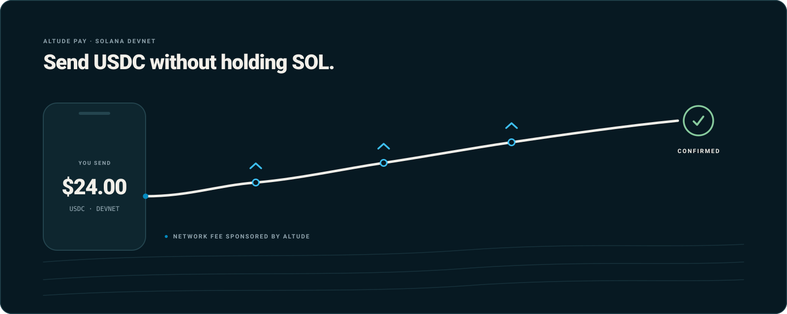

# Altude Pay

**Send USDC on Solana without ever holding SOL.**

Altude Pay is a reference React Native app for [Altude](https://altude.so) Gas Station.
It demonstrates a payment that behaves like an everyday consumer transfer: you enter an
amount, approve it on your device, and it arrives. There is no gas balance to top up,
and the private key never leaves the phone.



## Paying with crypto is still too hard

Most Solana payment flows ask the user to solve a problem they never asked about. Before
they can send a single dollar they need a second token — SOL — purely to pay the network
fee. That means another purchase, another wait, and a balance they have to remember to
keep topped up. If it runs dry, the payment simply fails.

Altude removes that step. Your application builds the transaction and the user signs it
locally; Altude validates it, attaches a sponsored fee payer, and relays it to the
network. The user never acquires SOL, and never surrenders their key to do it.


## What this demo does

- Generates and stores a local demo wallet on the device
- Reads SOL and USDC balances from Solana Devnet
- Builds, locally signs, sponsors, relays and confirms a USDC transfer
- Keeps transaction history and recent recipients on-device
- Generates and scans Solana Pay QR codes

## How it works


A payment moves through four participants:

1. **The app** collects the amount ([`SendScreen`](src/screens/SendScreen.tsx)) and the
   recipient ([`PayAddressScreen`](src/screens/PayAddressScreen.tsx)).
2. **Your device** signs the transaction. [`buildSigner`](src/services/solana.ts) holds
   the key bytes in the app process and signs locally with ed25519.
3. **Altude Gas Station** adds the fee payer signature and relays the transaction.
4. **Solana Devnet** confirms it, and the app polls for the result.

While this happens the app shows three stages — **Approving payment**, **Sending** and
**Confirming** — defined in
[`PaymentStatusScreen`](src/screens/PaymentStatusScreen.tsx).

The fee payer, RPC endpoint, short-lived RPC JWT and cluster are all resolved from your
API key by `GET /api/transaction/config`. You do not configure a network or a fee payer
address anywhere in this app.

## Where your keys live

The private key is generated on the device and is used only by the local signer. It is
not transmitted to Altude, and Altude cannot sign on your behalf — the relay adds its own
fee payer signature to a transaction you have already signed.

> [!WARNING]
> This is a demonstration wallet. [`saveWallet`](src/services/storage.ts) persists it as
> **plaintext JSON in AsyncStorage** — it is not encrypted and not hardware-backed. Use it
> on Devnet only. Do not put real funds in it.

## Tech Stack

| Library | Purpose |
|---|---|
| React Native 0.82 | Mobile framework |
| TypeScript | Type safety |
| React Navigation | Screen navigation |
| Zustand | Local wallet state |
| TanStack Query | Solana RPC caching |
| `@solana/kit` | Solana RPC, transactions and signing |
| `@solana-program/token` | SPL token / associated token accounts |
| `react-native-vision-camera` | QR code scanning |
| `react-native-svg` / `react-native-qrcode-svg` | QR rendering |
| AsyncStorage | Local persistence |

## Getting Started

### Request Altude Access

Before configuring the app, visit [Altude](https://altude.so) and complete the access-request form to receive an API key. Do not add the key to source code or commit it to the repository.

### Configure Local Environment

Create a `.env` file in the repository root using `.env.example` as a template:

```bash
ALTUDE_API_KEY=replace_with_your_key
```

For Altude configuration, the API key is the only required value. The API key's
`/api/transaction/config` response determines the cluster, RPC URL, JWT, and
fee payer. Users should not need to enter a fee payer address or choose a
network manually.

Restart Metro after changing `.env`. The app ships with `useMockData: false` in
[`src/config/runtimeConfig.ts`](src/config/runtimeConfig.ts), so a valid API key is
required to get past onboarding. Setting `useMockData: true` runs the app against local
demo data without a key.

Install dependencies from repository root:

```bash
npm install
```

Start Metro:

```bash
npm start
```

Run the app:

```bash
# Android
npm run android

# iOS
npm run ios
```

For iOS, install CocoaPods first:

```bash
cd ios && pod install
```

## Validation Commands

```bash
npm run lint
npm run type-check
npm test
```

## Network

- Solana cluster: **Devnet**
- Devnet USDC mint: `4zMMC9srt5Ri5X14GAgXhaHii3GnPAEERYPJgZJDncDU`
- Altude API base: `https://api.altude.so`

<details>
<summary><strong>Android Altude SDK integration and instrumentation tests</strong></summary>

The Android app module is configured to use Altude AndroidSDK from JitPack with:

- `com.github.AltudePlatform.AndroidSDK:core:chen~pay-demo-02-SNAPSHOT`
- `com.github.AltudePlatform.AndroidSDK:gasstation:chen~pay-demo-02-SNAPSHOT`
- `com.github.AltudePlatform.AndroidSDK:vault:chen~pay-demo-02-SNAPSHOT`

JitPack is added in Android Gradle settings repositories.

### Instrumentation Tests (Setup / Create Account / Send USDC)

Implemented test class:

- `android/app/src/androidTest/java/com/altudepay/AltudeGasstationInstrumentedTest.kt`

Required values (set as environment variables or Gradle properties):

- `ALTUDE_ACCOUNT_PRIVATE_KEY_BASE64` (optional)

The instrumentation tests use a static demo API key constant in
`AltudeGasstationInstrumentedTest.kt`.

If `ALTUDE_ACCOUNT_PRIVATE_KEY_BASE64` is not provided, the send test generates a temporary sender account and attempts account creation before transfer.

Run test compilation:

```bash
cd android
./gradlew :app:compileDebugKotlin :app:compileDebugAndroidTestKotlin
```

Run instrumentation tests on a connected emulator/device:

```bash
cd android
./gradlew :app:connectedDebugAndroidTest
```

</details>

## Documentation artwork

The diagrams above are hand-authored SVG built from this app's own design tokens and
components. See [`docs/images/README.md`](docs/images/README.md) for the palette,
geometry, and the accessibility and claim rules they follow.

## License

See [LICENSE](LICENSE).
